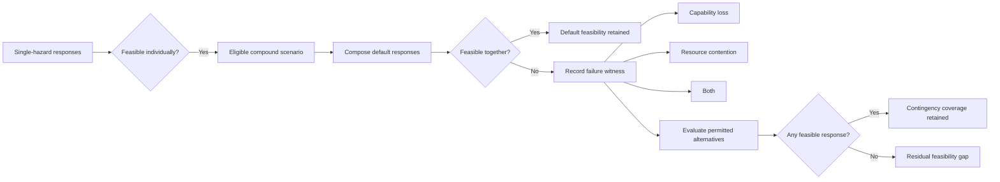

# Compound-Hazard Feasibility Gap (CHFG)

Companion resources for **“Compound-Hazard Feasibility Gaps in Climate Adaptation Planning”** by Srimonti Dutta and Akshata Kishore Moharir.

A response plan can pass its single-hazard feasibility checks and still lose executability when several hazards occur together. CHFG measures the weighted share of constituent-valid compound scenarios in which the **default combined response** becomes infeasible because required capabilities are unavailable, shared capacity is exceeded, or both.

## At a glance

| Illustrative case | Result |
|---|---:|
| Goal-activating single-stressor baselines | 3 / 3 feasible |
| Eligible two- and three-stressor scenarios | 19 |
| Default compositions losing feasibility | 10 |
| **CHFG** | **10 / 19 ≈ 0.53** |
| Scenarios with at least one feasible permitted response | 15 |
| **Contingency coverage** | **15 / 19 ≈ 0.79** |

The case uses uniform scenario weights. The six public action records come from the **2024 New York City Hazard Mitigation Plan Mitigation Actions Database**; the dependency model, normalized capacities and demands, stress effects, and response roles form the paper's controlled analytical experiment.

## The diagnostic



For an evaluated compound-scenario family \(\mathcal C\), CHFG conditions on the subset \(\mathcal C^+\) whose response-triggering constituents pass their corresponding single-hazard checks:

\[
\mathrm{CHFG}=
\frac{\sum_{S\in\mathcal C^+}w_S\,\mathbb I[F(M_S,\omega_S)=0]}
{\sum_{S\in\mathcal C^+}w_S}.
\]

The failure witness is retained alongside the scalar result so that capability loss and shared-resource contention can be traced to specific plan dependencies.

## Where to start

### Apply CHFG to a plan

Start with [`APPLYING_CHFG.md`](APPLYING_CHFG.md). It gives the audit sequence from action extraction and dependency mapping through constituent checks, compound feasibility, failure diagnosis, and contingency coverage.

The reusable records are in [`templates/`](templates/):

- [`action_record.csv`](templates/action_record.csv) for plan actions, goals, capabilities, resources, and source references;
- [`scenario_record.csv`](templates/scenario_record.csv) for compound states, weights, feasibility outcomes, and failure witnesses;
- [`audit_record.md`](templates/audit_record.md) for reporting the resulting audit.

### Read the formal definition

[`SPECIFICATION.md`](SPECIFICATION.md) collects the planning objects, eligibility rule, CHFG definition, contingency coverage, failure indicators, reporting requirements, and terminology used across the repository.

### Inspect the worked case

[`examples/nyc_worked_example.md`](examples/nyc_worked_example.md) walks through the New York City mitigation-action fragment used in the paper. The supporting records in [`data/`](data/) include the six source actions, the illustrative response model, scenario assumptions, scenario-level results, and severity sensitivity.

## What the New York City records contribute

The public mitigation-action records provide the action identities and documented purposes used to construct the case. The controlled experiment then assigns protection goals, default and alternative roles, capability dependencies, normalized resource demands, scenario-conditioned capacities, and stress effects. Keeping these layers separate makes the worked example inspectable while preserving the distinction between source material and analytical assumptions.

The action source is the New York City Hazard Mitigation Plan Mitigation Actions Database:

https://nychazardmitigation.com/documentation/mitigation/actions/

## Reusing CHFG

A new application needs four ingredients: a response plan, a compound-scenario family, an explicit model of required capabilities and shared resources, and a declared rule for combining constituent responses. Scenario weights may represent a uniform stress-test design or, when defensible joint probabilities are available, a specified planning distribution or climate horizon.

The most useful output is usually a small set of linked results rather than CHFG alone: constituent coverage, CHFG, contingency coverage, and the capability/resource witnesses for failed default compositions. Together they show where separately workable responses cease to compose and which permitted alternatives preserve coverage.

## Repository map

```text
.
├── README.md
├── APPLYING_CHFG.md
├── SPECIFICATION.md
├── data/
│   ├── README.md
│   ├── nyc_actions.csv
│   ├── illustrative_action_model.csv
│   ├── scenario_assumptions.csv
│   ├── scenario_results.csv
│   └── sensitivity_results.csv
├── examples/
│   ├── nyc_worked_example.md
│   └── representative_traces.csv
└── templates/
    ├── action_record.csv
    ├── scenario_record.csv
    └── audit_record.md
```

